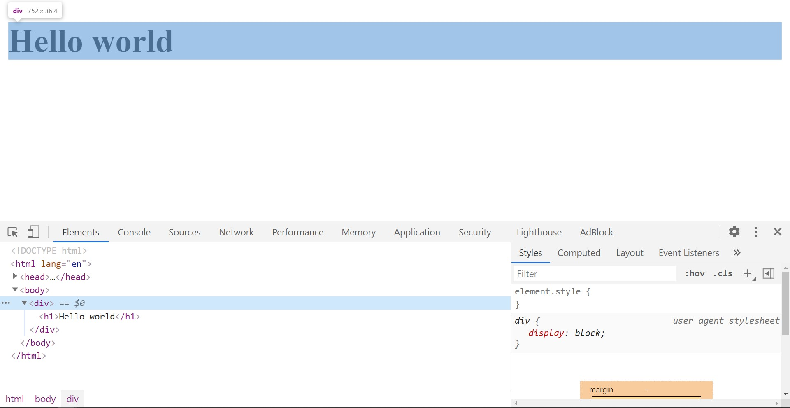
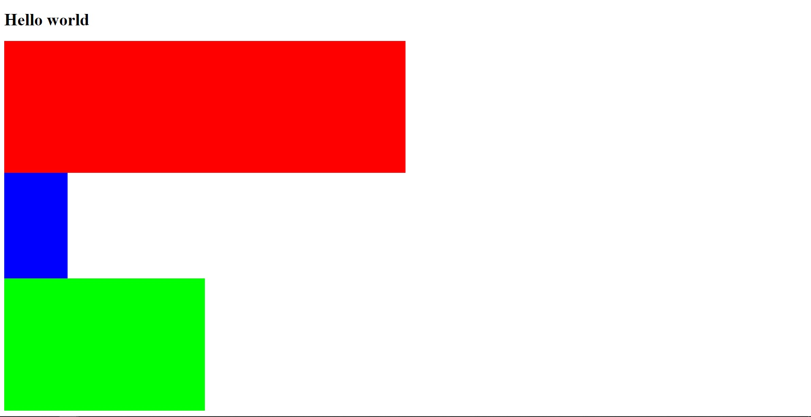
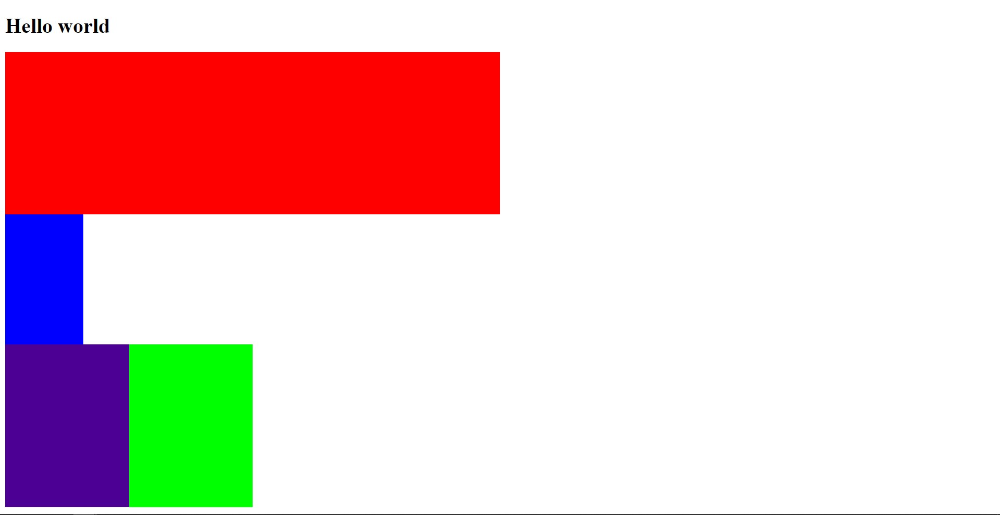

# Блочная вёрстка

## Стандарты HTML

---

### Что за стандарты?

Когда-то давно народ огня...
КОгда-то давно существовало множество неофициальных стандартов HTML, которые развивались отдельными лицами. Соответсвенно в них были разные реализации и возможности. Из-за того, что существовало много различных стандартов разработчикам браузеров было плохо, потому что они не могли прописать правиля всех стандартов. Именно поэтому в 1995 Инженерный совет интернета (IETF) выпустил единый стандарт HTML. Получил он версию 2.0 для того чтобы отличался от неофициальных стандартов. И с тех пор началось...
По мере выхода разлицных стандартов HTML добавлялись всё новые и новые фишки, которые облегчали жизнь разработчикам, улучшали визуальную составляющую страниц. На данный момент самой актуальной версией HTML является HTML5.

## Немного истории

_Мы перепрыгнем первые версии HTML и перейдём сразу к HTML4_

---

### Проблема при вёрстке веб-страницы

Вы могли заметить, что различные теги типа \<p>, заголовков располагается друг под другом, а что если нужно расположить элементы в несколько столбцов? Использовать боковые меню и прочее?
На начальных этапах развития веба была проблема позиционирования элементов и текста на веб-странице

### **Табличная вёрстка**

Решением проблемы была табличная вёрстка, которая была актуально в начале 2000-ых годах. Выглядела она следующим образом _(вставить картинку с кодом и результатом)_

### Достоинства и недосатки

_2 столбца. Достоинства и недостатки_

- Достоинства

  - Резиновый макет. Табличный способ верстки позволяет легко сделать резиновый макет, задав ширину в процентах. С помощью различных настроек можно регулировать высоту ячеек внутри.

  - Создание декоративных эффектов. Каждой ячейке можно задать отдельный фоновый рисунок и размеры. Таким способом раньше создавали массу декоративных эффектов: нестандартные рамки, уголки, тени.

  - Вертикальное выравнивание. Внутри таблиц поддерживается выравнивание, как по горизонтали, так и по вертикали. В этом плане они выигрывают у блоков, хотя сегодня появился флексбокс, в котором тоже есть возможность отцентрировать по вертикали.

  - Кроссбраузерность. Теги для табличных данных появились очень давно и поддерживаются даже в старейших версиях Internet Explorer. Сайт на таблицах одинаково выглядит в разных браузерах.

- Недостатки

  - Огромный код. Для вывода таблицы требуется множество тегов. В реальных примерах табличной верстке часто встречаются еще и вложенные таблицы. В-общем, даже на разметку достаточно простой страницы может понадобиться 200+ строчек кода. Мало того, редактировать такую разметку также не очень просто.

  - Ухудшение скорости зарузки. Таблица имеет одну очень нехорошую особенность – она не будет отображена до тех пор, пока все ее ячейки, включая самые нижние, не будут загружены. И тут представьте себе ситуацию, что вы вывели на странице 20 изображений в таблице. Как вы думаете, быстро ли они загрузятся?

  - Плохая индексация. А вот это еще более значительный минус. Из-за большой разметки и обилия вложенных тегов текст на странице хуже воспринимается поисковыми системами и даже отлично оптимизированная и интересная статья может не попасть в топ.

  - Неудобное управление через стили. Опять же, из-за обилия вложенных тегов таблицу сложно стилизовать через стили. Вам придется дописать множество атрибутов в html, что еще больше увеличит код.

  - Несоответствие стандартам разработки. Как уже и говорилось, табличный способ верстки был придуман веб-разработчиками, но на самом деле эти теги изначально предназначались только для вывода табличных данных и больше ни для чего другого. Все остальные варианты использования табличных тегов не являются правильными с точки зрения стандартов.

### Вывод по табличной вёрстке

Данный способ был актуален в бородатые времена когда альтернатив по сути небыло и приходилось мириться со всеми представленными недостатками. В данный момент такой способ разработки веб-страницы абсолютно неактуален и в 2011 году был признан неактуален.

### **Блочная вёрстка**

Примерно в одно время с табличной вёрсткой был ещё один тип вёрстки, а именно блочная вёрстка. Это вёрстка на основе элементов представляющих из себя прямоугольные области в которые можно было помещать другие элементы и текст. Для изменения различных свойств блоков нужно было работать с CSS, что было сложнее чем менять свойства ячеек таблиц. _(втсавить картинку с кодом и результатом)_

### Достоинства и недостатки

_2 столбца. Достоинства и недостатки_

- Достоинства

  - Меньший объем кода. Монструозность создаваемого кода при использовании верстки таблицами во многих случаях создавала проблемы даже для самих верстальщиков, поскольку в огромном массиве кода несложно и самому запутаться. При использовании div-блоков все гораздо логичнее и понятнее, да и сам код страницы уменьшается в несколько раз – основная часть описания визуального вида выноситься в css-файл, который загружается одноразово, и потом просто кэшируется браузером. Таким образом, не только уменьшается время загрузки страницы, но и снижается нагрузка на сервер.

  - Удобство изменения элементов. Изменить практически любой из элементов внешнего вида макета сайта можно путем правки файла стилей.

  - Преимущества в плане SEO. Мы уже писали, что в таблицах контент раскидан по разным ячейкам, что усложняет индексацию поисковыми роботами. С div-слоями такой проблемы не существует, поскольку вместо кода сначала распознается контент, и на странице он размечается семантически правильно. Это неоспоримое преимущество, которое должно учитываться владельцами современных сайтов.

  - Читабельность кода. Макет сайта, при создании которого использовалась корректная блочная верстка, будет соответствовать стандартам валидности W3C, а меньший объем кода и его логическая разметка, упрощает визуальное восприятие со стороны разработчика. Отсутствуют сложные конструкции из нагромождений тегов, код компактный и читабельный. Работать с таким действительно приятно.

  - Реализация сложных задач. С помощью блоков реализовать различные задачи по нестандартному расположению и оформлению элементов сайта гораздо проще, чем при использовании таблиц. С помощью нескольких инструкций можно реализовать такие расширенные возможности как выпадающие списки меню, эффекты скругленых углов и теней, а также другие визуальные эффекты, которые делают сайт более выразительным и понятным для посетителя.

  - Возможность создания адаптивного дизайна. Наметившийся несколько лет назад тренд в виде создания специальных мобильных сайтов на поддомене, оказался несостоятельным и неэффективным. Ему на смену пришла концепция «адаптивного дизайна» или responsive design, суть которой в создании макета, который одинаково корректно отображается на устройствах с различным разрешением экрана – от стационарных PC и до смартфонов или планшетов. **_(в табличной вёрстке имелось в виду, что дизайн одинаково хорошо смотрится в браузере на ПК в различных разрешениях. в данном случае идёт речь о изменении дизайна при посещении сайта с телефона и ПК. Например бургер меню, выравнивания картинок в один столбец, а не в несколько и т.д.)_**

- Недостатки

  - Сложности в освоении. Если начать работать с таблицами может начать и новичок в сайтостроении, то верстку слоями освоить сложнее, управление блоками требует хороших знаний не только HTML, но и CSS. Тем не менее, каскадные таблицы стилей предлагают столько возможностей, что потратить время на их изучение однозначно стоит.

  - Горизантальное размещение элементов на веб-странице. Для того чтобы разместить несколько блоков в горизонтальной плоскасти разработчику приходилось прибегать к различным хитростям(В HTML5 данная проблема была устранена).

  - Центрирование элементов по обеим осям

### Вывод по блочной вёрстке.

Хотя и блочная вёрстка более сложна в освоении, тем не менее преимущества перекрывают данный недостаток, поэтому в HTML4 была более предпочтителен именно данный способ создания веб-страниц. В HTML5 также была устранена сложность при горизонтальном расположении блоков.

## **Практика по блочной вёрстке**

### Что же это за зверь?

Блочная верстка — это подход, при котором сайт строят на основе «блоков», в качестве которых выступают, как правило, теги \<div>. В англоязычных источниках такой подход называют Layouts. Блоки при таком подходе располагаются один под другим, но при помощи стандарта CSS разработчики могут менять их порядок отображения и позиционирование, а также задавать одному объекту различные стили на различных разрешениях браузеров. По сути это просто контейнер, который удобно стилизовать.

### Как создать блок?

Для создания блока используется парный тег \<div> elements \</div>. Если создать блок без начинки, то он будет иметь значение высоты - 0px, а значение ширины - 100% родителя.



### Обязательные условия

Все блочные элементы должны содержать в себе какой-либо селектор (селектор класса или селектор идентификатора). Также важно помнить, что каждый новый блок распологается под предыдущем. При этом html всё равно есть ли свободное пространство или нет. Каждый новый блок всегда будет ниже предыдущего. Давайте создадим 3 новых блока, при этом зададим им средствами CSS ширину <100%, какую-то высоту и цвет заднего фона. Ширина задаётся свойством width, высота height, задний цвет фона background-color.

```html
<!DOCTYPE html>
<html lang="en">
  <head>
    <link rel="stylesheet" href="./style.css" />
    <meta charset="UTF-8" />
    <meta name="viewport" content="width=device-width, initial-scale=1.0" />
    <title>Document</title>
  </head>
  <body>
    <div>
      <h1>Hello world</h1>
    </div>

    <div class="first"></div>
    <div class="second"></div>
    <div class="percent_height"></div>
    <div class="third"></div>
  </body>
</html>
```

```css
.first {
  width: 50%;
  height: 250px;
  background-color: rgb(255, 0, 0);
}

.second {
  width: 120px;
  height: 200px;
  background-color: rgb(0, 0, 255);
}

.percent_height {
  width: 50%;
  height: 100%;
  background-color: rgb(76, 0, 148);
}

.third {
  width: 25%;
  height: 250px;
  background-color: rgb(0, 255, 0);
}
```



### Блок в блоке ©Xzibit (сейчас будет сложно)

Блок может содержать не только другие элемент, но и другие блоки. Именно благодаря помещению блоков в блок в будущем мы научимся выранивать их по горизонтали, центровать и т.д. Также если раньше бы мы задали блоку процентную высоту, то он бы всё равно остался бы 0px. А теперь...

```html
<!DOCTYPE html>
<html lang="en">
  <head>
    <link rel="stylesheet" href="./style.css" />
    <meta charset="UTF-8" />
    <meta name="viewport" content="width=device-width, initial-scale=1.0" />
    <title>Document</title>
  </head>
  <body>
    <div>
      <h1>Hello world</h1>
    </div>

    <div class="first"></div>
    <div class="second"></div>
    <div class="third">
      <div class="percent_height"></div>
    </div>
  </body>
</html>
```

```css
.first {
  width: 50%;
  height: 250px;
  background-color: rgb(255, 0, 0);
}

.second {
  width: 120px;
  height: 200px;
  background-color: rgb(0, 0, 255);
}

.percent_height {
  width: 50%;
  height: 100%;
  background-color: rgb(76, 0, 148);
}

.third {
  width: 25%;
  height: 250px;
  background-color: rgb(0, 255, 0);
}
```



### В чём же дело?

Дело в том, что высота body зависит от размера элементов которые расположены на веб-странице. То есть если добавить на страницу блок с 100% высотой, то он будет 0, так как body по умолчанию 0.

В первом случае body растянулся на сумму высот всех блоков которые указаны в px или растянуты контентом и не на пиксель больше. Соответсвенно для блока у которого указана высота в % просто не остаётся места. Чтобы иметь возможность растянуть блок в процентах в body можно задать размер для body. Но так дела не делаются.

Во втором же у внешнего блока была задана статичная высота в px, поэтому внутренний блок растянулся.
