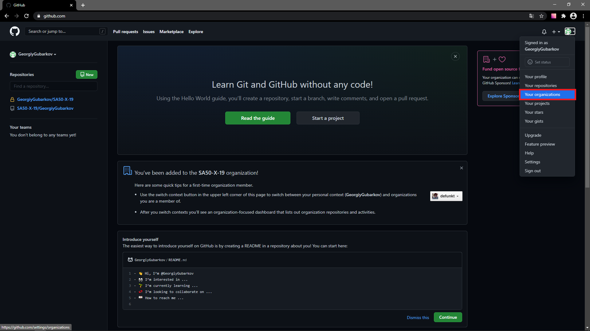
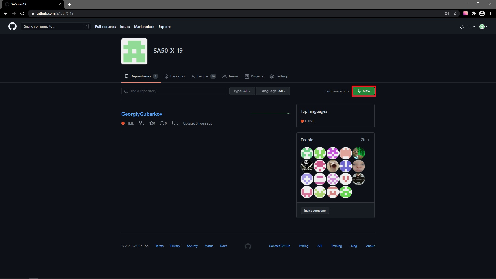

# Требования

## Требования к репозиторию

Необходимо создать публичный репозиторий в организации SA50-X-19. Это возможно сделать, если вас добавили в неё. Чтобы посмотреть добавили вас или нет - откройте таблицу, в которую необходимо было внести username от GitHub. Аккаунты выделенные зелёным - добавлены. После добавления должно прийти письмо на почту с подтверждением регистрации в организации.
Если вы были добавлены и у вас есть возможность перейти в организацию, то:

1. Откройте [GitHub](https://github.com/)
2. Перейдите в "Ваши организации"

1. Перейдите в организацию SA50-X-19

1. Выберите New

1. Создайте публичный репозиторий с README файлом. В качестве названия использовать SA50-X-19_UserName. Вместо Х - подставить свою группу.
2. После создания репозитория на GitHub установите его локально
3. Для скачивания используется следующая команда(откройте диск, где будете хранить репозиторий и запустите GitBush/cmd/bash)
```git
git clone {ссылка https}
```
8. В клонированном репозитории создайте ветку gh-pages
---
## Требования к коммитам

1. Все задания делать в новых ветках созданных из master, если не указано иное
2. После создания ветки для задания - создавайте папку с названием задания. 
3. Внутри папки создавайте файлы index.html и style.css
4. В master никаких коммтитов не делать
5. В master не мержить
6. Все коммиты пишутся исключительно на латинице, осмысленными предложениями. Пользуйтесь переводчиком.
7. Для задания необходимо сделать минимум 3 коммита.
### Формат коммитов

* init: - используется для начала проекта/таска. Примеры:
  * init: start youtube-task
  * init: start mentor-dashboard task

* feat: - это реализованная новая функциональность из технического задания (добавил поддержку зумирования, добавил footer, добавил карточку продукта). Примеры:
  * feat: add basic page layout
  * feat: implement search box 
  * feat: implement request to youtube API
  * feat: implement swipe for horizontal list
  * feat: add additional navigation button
  * feat: add banner
  * feat: add social links
  * feat: add physical security section
  * feat: add real social icons

* fix: - исправил ошибку в ранее реализованной функциональности. Примеры:
  * fix: implement correct loading data from youtube
  * fix: change layout for video items to fix bugs
  * fix: relayout header for firefox
  * fix: adjust social links for mobile

* refactor: - новой функциональности не добавлял / поведения не менял. Файлы в другие места положил, удалил, добавил. Изменил форматирование кода (white-space, formatting, missing semi-colons, etc). Улучшил алгоритм, без изменения функциональности. Примеры:
  * refactor: change structure of the project
  * refactor: rename vars for better readability
  * refactor: apply eslint
  * refactor: apply prettier

* docs: - используется при работе с документацией/readme проекта. Примеры:
  * docs: update readme with additional information
  * docs: update description of run() method

## Формат сдачи практических

* Получив новую работу, необходимо создать новую ветку из mster с латинским названием практической (названия будут указаны на Кириллице и Латинице). 
* Перейдите в ветку с заданием и создайте папку с названием задания.
* В папке создайте фалы:
  * Если это одностраничный сайт:
    * В папке с заданием создать файлы index.html и style.css
  * Если многостраничный сайт:
    * pass
* В ветке с заданимем необходимо сделать минимум 3 коммита отражающих процесс разработки. 
* Коммиты выполнять в соответсвии с разделом > Фомат коммитов
* После выполнения задания необходимо запушить изменения на GitHub в ваш репозиторий. 
* После выполнения задания - заливайте его на GitHub, создавай PullRequest в мастер (без слияния, просто создать PR) и мержите в gh-pages
* В classroom прикрепить ссылку на выполненное задание в google формы, которые будут прикреплены к заданию. 
* Ссылка должна иметь следующий вид:
  > https://sa50-x-19.github.io/repo/folder_task/ , где
  * repo - название вашего репозитория
  * folder_task - название папки с файлом index.html вашего задания
