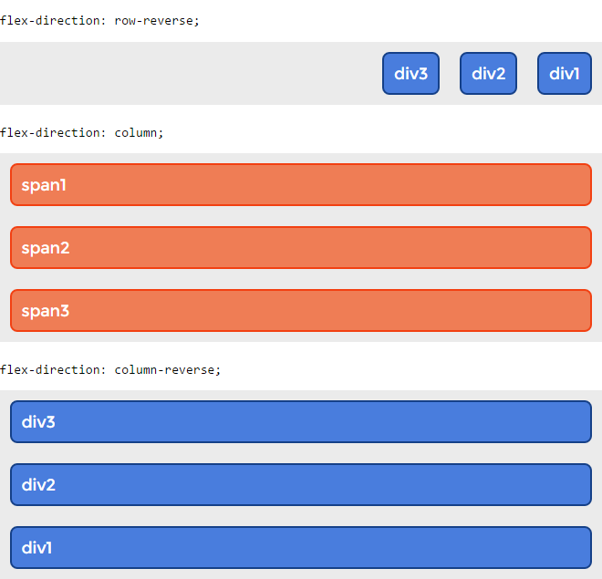
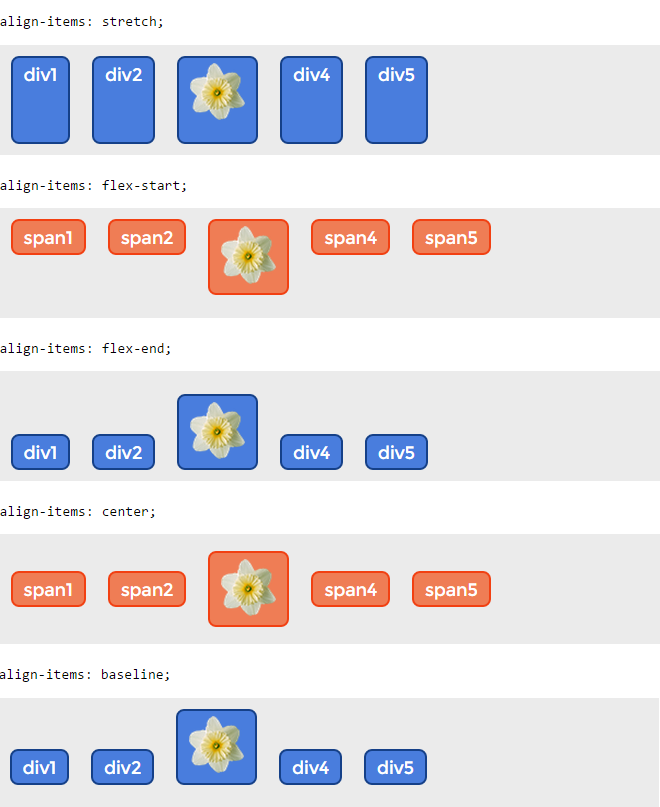

# Flexbox

CSS flexbox (Flexible Box Layout Module) — модуль макета гибкого контейнера — представляет собой способ компоновки элементов, в основе лежит идея оси.

Flexbox состоит из гибкого контейнера (flex container) и гибких элементов (flex items). Гибкие элементы могут выстраиваться в строку или столбик, а оставшееся свободное пространство распределяется между ними различными способами.

Flexbox решает специфические задачи — создание одномерных макетов, например, навигационной панели, так как flex-элементы можно размещать только по одной из осей.


Flex-контейнер устанавливает новый гибкий контекст форматирования для его содержимого. Flex-контейнер не является блочным контейнером, поэтому для дочерних элементов не работают такие CSS-свойства, как float, clear, vertical-align. Также, на flex-контейнер не оказывают влияние свойства column-\*, создающие колонки в тексте и псевдоэлементы ::first-line и ::first-letter.

После установки данных значений свойства каждый дочерний элемент автоматически становится flex-элементом, выстраиваясь в один ряд (вдоль главной оси). При этом блочные и строчные дочерние элементы ведут себя одинаково, т.е. ширина блоков равна ширине их содержимого с учетом внутренних полей и рамок элемента.

## Создание флекс элементов

Чтобы использовать данный модуль, необходимо блоку-контейнеру, который содержит элементы, которые нужно спозиционировать, задать css свойство display:flex

```html
<div class="flex-conteiner">
  <div class="flex-items">Пункт 1</div>
  <div class="flex-items">Пункт 2</div>
  <div class="flex-items">Пункт 3</div>
  <div class="flex-items">Пункт 4</div>
  <div class="flex-items">Пункт 5</div>
</div>
```

```css
.flex-conteiner {
  display: flex;
}
```

```markdown
Note: Все непосредственные потомки контейнера спозиционируются по горизонтали. И станут доступны свойства для выравнивания и позиционирования.
```

## Порядок отображения flex-элементов и ориентация

Содержимое flex-контейнера можно разложить в любом направлении и в любом порядке (переупорядочение flex-элементов внутри контейнера влияет только на визуальный рендеринг).

### Направление главной оси: flex-direction

Свойство относится к flex-контейнеру. Управляет направлением главной оси, вдоль которой укладываются flex-элементы, в соответствии с текущим режимом записи. Не наследуется.

**_flex-direction:_**
| Значение | Описание |
| ------------- | ------------- |
| row | Значение по умолчанию, слева направо (в rtl справа налево). Flex-элементы выкладываются в строку. Начало (main-start) и конец (main-end) направления главной оси соответствуют началу (inline-start) и концу (inline-end) оси строки (inline-axis). |
| row-reverse | Направление справа налево (в rtl слева направо). Flex-элементы выкладываются в строку относительно правого края контейнера (в rtl — левого). |
| column | Направление сверху вниз. Flex-элементы выкладываются в колонку. |
| column-reverse | Колонка с элементами в обратном порядке, снизу вверх. |



## Выравнивание

### Выравнивание по главной оси: justify-content

Свойство выравнивает flex-элементы по главной оси flex-контейнера, распределяя свободное пространство, незанятое flex-элементами. Когда элемент преобразуется в flex-контейнер, flex-элементы по умолчанию сгруппированы вместе (если для них не заданы поля margin). Промежутки добавляются после расчета значений margin и flex-grow. Если какие-либо элементы имеют ненулевое значение flex-grow или margin: auto;, свойство не будет оказывать влияния. Свойство не наследуется.

**_justify-content_**

| Значение      | Описание                                                                                                                                                                                                                                                                                                                                                                                                                                                         |
| ------------- | ---------------------------------------------------------------------------------------------------------------------------------------------------------------------------------------------------------------------------------------------------------------------------------------------------------------------------------------------------------------------------------------------------------------------------------------------------------------- |
| flex-start    | Значение по умолчанию. Flex-элементы выкладываются в направлении, идущем от начальной линии flex-контейнера.                                                                                                                                                                                                                                                                                                                                                     |
| flex-end      | Flex-элементы выкладываются в направлении, идущем от конечной линии flex-контейнера.                                                                                                                                                                                                                                                                                                                                                                             |
| center        | Flex-элементы выравниваются по центру flex-контейнера.                                                                                                                                                                                                                                                                                                                                                                                                           |
| space-between | Flex-элементы равномерно распределяются по линии. Первый flex-элемент помещается вровень с краем начальной линии, последний flex-элемент — вровень с краем конечной линии, а остальные flex-элементы на линии распределяются так, чтобы расстояние между любыми двумя соседними элементами было одинаковым. Если оставшееся свободное пространство отрицательно или в строке присутствует только один flex-элемент, это значение идентично параметру flex-start. |
| space-around  | Flex-элементы на линии распределяются так, чтобы расстояние между любыми двумя смежными flex-элементами было одинаковым, а расстояние между первым / последним flex-элементами и краями flex-контейнера составляло половину от расстояния между flex-элементами.                                                                                                                                                                                                 |


### Выравнивание по поперечной оси: align-items

Flex-элементы можно выравнивать по поперечной оси текущей строки flex-контейнера. align-items устанавливает выравнивание для всех элементов flex-контейнера, включая анонимные flex-элементы.

| Значение   | Описание                                                                                                                                                                          |
| ---------- | --------------------------------------------------------------------------------------------------------------------------------------------------------------------------------- |
| flex-start | Верхний край flex-элемента помещается вплотную с flex-линией (или на расстоянии, с учетом заданных полей margin и рамок border элемента), проходящей через начало поперечной оси. |
| flex-end   | Нижний край flex-элемента помещается вплотную с flex-линией (или на расстоянии, с учетом заданных полей margin и рамок border элемента), проходящей через конец поперечной оси.   |
| center     | Поля flex-элемента центрируется по поперечной оси в пределах flex-линии.                                                                                                          |
| baseline   | Базовые линии всех flex-элементов, участвующих в выравнивании, совпадают.                                                                                                         |



## Ссылки на литературу

- [Основы flexbox](https://html5book.ru/css3-flexbox/)
